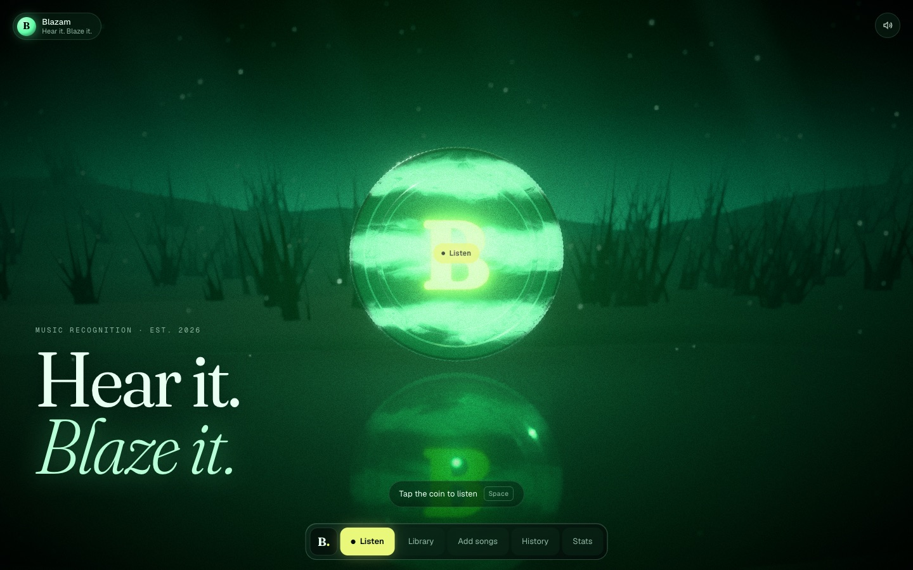
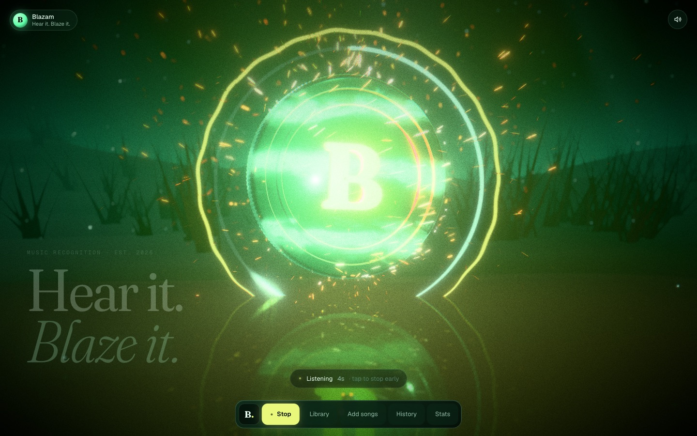
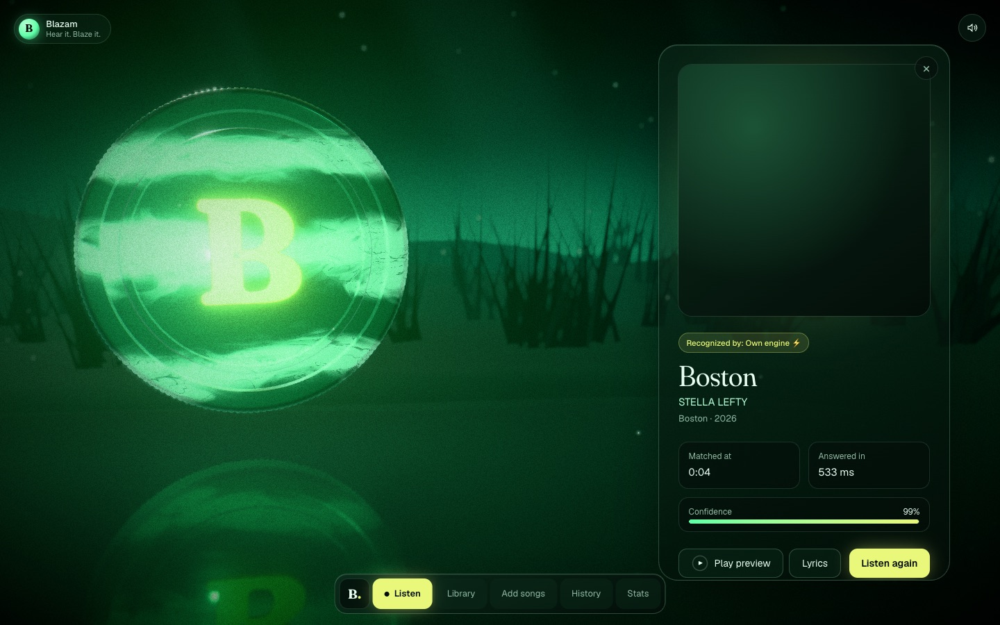
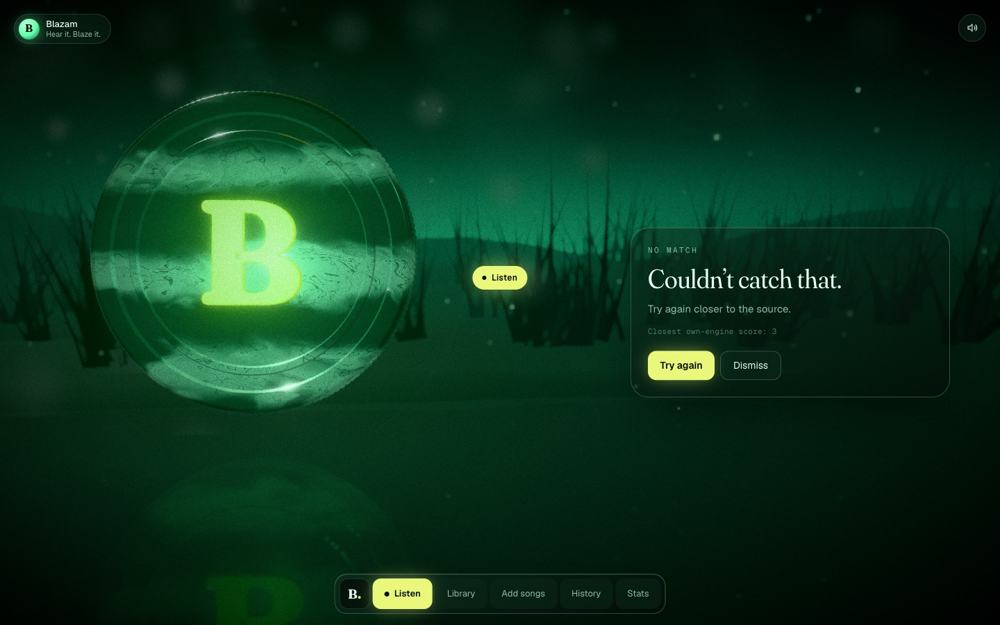
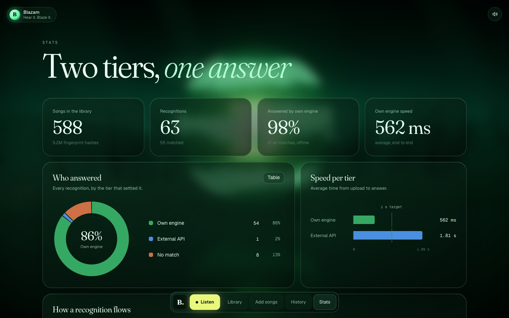
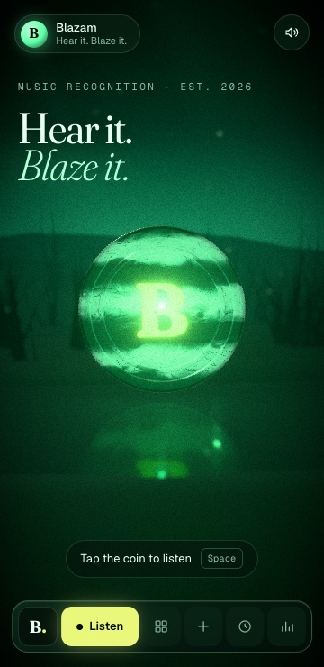
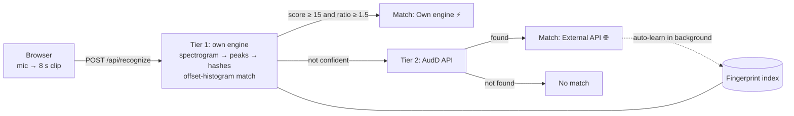

# Blazam

**Hear it. Blaze it.** A Shazam-style music recognizer, with a fingerprinting engine built from
scratch and an immersive 3D frontend. Tap a marbled emerald coin in a misty landscape: it spins
up, throws fire sparks to the beat while it listens, and reveals the song.



## Highlights

- **Own recognition engine.** A landmark-fingerprinting implementation of Wang (2003), the paper
  behind Shazam. It matches 9M+ hashes in memory: **p50 165 ms** end to end at 545 songs, 100%
  top-1 on 5 s clips (including 0 dB noise), and 0 false positives across 462 negatives.
- **Two-tier hybrid.** When the own engine isn't confident, it falls back to the AudD API.
  **Auto-learn** then fingerprints that song in the background, so next time the own engine
  answers.
- **Immersive frontend.** A real-time WebGL scene: a shader-marbled coin, GPU spark particles
  that react to the live mic level, a reflective pool, fog, bloom and depth of field. It runs at
  60 fps and adapts quality on slower devices.
- **Honest UX.** Confidence is shown only when the engine has one, the source is labelled on
  every result, it says "couldn't catch that" instead of guessing, and every error state is
  designed.

| Listening (sparks follow the mic) | Result (own engine) |
|---|---|
|  |  |
| **No match** | **Stats: the hybrid at work** |
|  |  |

<p align="center"></p>

## How it works



A clip is turned into a spectrogram. The engine picks its strongest peaks and pairs them into
hashes ("frequency A, then frequency B, Δt later"), then looks them up in the index. The right
song is the one where hundreds of hashes agree on the same time offset. Chance matches score
about 2 to 12, and real matches score from tens to thousands. The full write-up, with figures
and the evaluation, is in [`backend/README.md`](backend/README.md) and
[`backend/docs/ALGORITHM.md`](backend/docs/ALGORITHM.md).

## Tech

| | |
|---|---|
| **Backend** (`backend/`) | Python 3.11, FastAPI, numpy/scipy, SQLite plus an in-memory index, ffmpeg. Clients for Deezer, iTunes, MusicBrainz, Cover Art Archive, LRCLIB and AudD. 87 tests |
| **Frontend** (`frontend/`) | Next.js 16, TypeScript, Tailwind 4, React Three Fiber + drei + postprocessing, Framer Motion, Zustand, Zod. Playwright e2e against the real backend |

## Run it locally

Requires Python 3.11, Node 20+ and ffmpeg.

```bash
# backend → http://localhost:8000
cd backend
python3.11 -m venv .venv && .venv/bin/pip install -r requirements-dev.txt
cp .env.example .env          # add AUDD_API_TOKEN (optional) and your contact in BLAZAM_USER_AGENT
.venv/bin/python -m app.seed --source deezer --chart --limit 300   # build the library (~17 min)
.venv/bin/uvicorn app.main:app --port 8000

# frontend → http://localhost:3000
cd frontend
npm install
npm run dev
```

Open http://localhost:3000, play a song from the library on a speaker, and tap the coin
(or press Space).

**Good to know:** songs seeded from Deezer are indexed from their **30-second preview**. A clip
matches only if it overlaps that slice, which is usually the chorus. Full-length files you add
under **Add songs** (or with `python -m app.index <folder>`) match anywhere.

## Deploy

- **Backend → Render:** Docker web service with a persistent disk at `/data`. See "Deploy on
  Render" in [`backend/README.md`](backend/README.md).
- **Frontend → Vercel:** root directory `frontend`, with `BLAZAM_API_ORIGIN` set to the Render
  URL. The site proxies `/backend/*` to it, so no public env vars or CORS setup are needed. See
  [`frontend/README.md`](frontend/README.md).

## Tests

```bash
cd backend && .venv/bin/pytest                               # 87 tests: DSP, matching, API, clients
cd frontend && npm run e2e:audio && npm run test:e2e         # 7 browser tests against the live backend
```

## Notes

Audio is never committed. The library's previews and uploads live in the git-ignored
`backend/data/` and are for personal/dev use, not redistribution. A public deployment serves
preview audio, so keep it access-protected.
