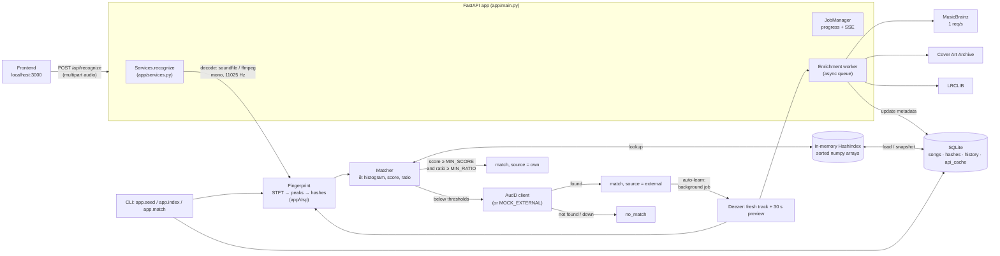
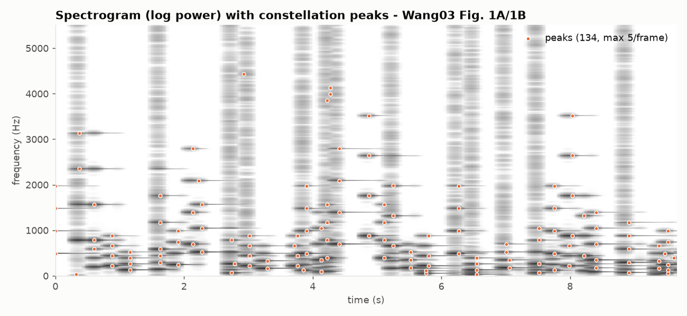
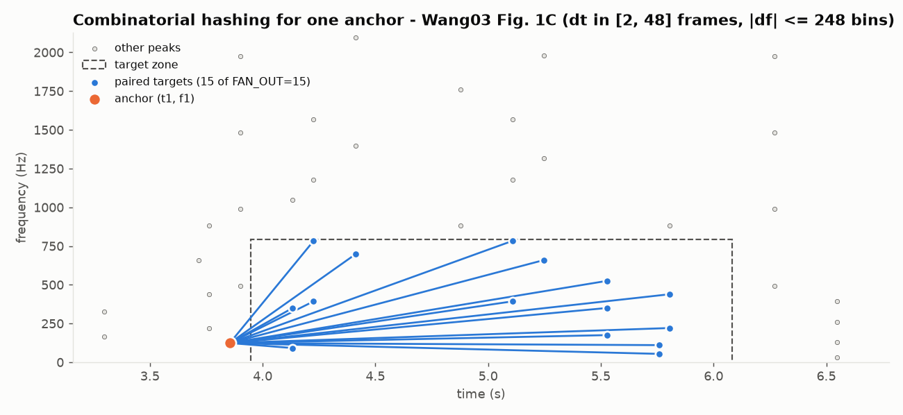
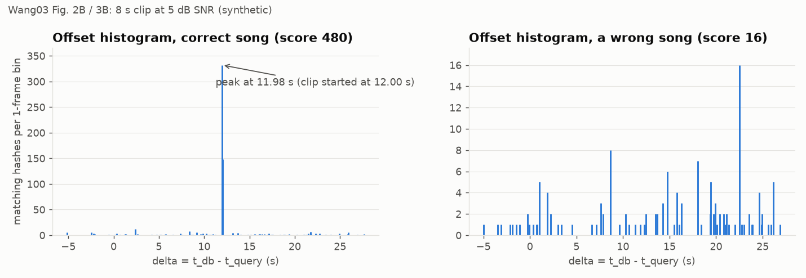

# Blazam backend

A Shazam-style music recognizer. One endpoint, two tiers:

1. **Tier 1 (own engine, offline).** A landmark-fingerprinting implementation of Wang (2003),
   matched against your indexed library. ~165 ms end-to-end at 545 songs.
2. **Tier 2 (AudD).** Used only when Tier 1 is below its thresholds. The result comes back
   immediately, and with **auto-learn** on, the song's Deezer 30 s preview is downloaded,
   fingerprinted and indexed in the background, so the next time Tier 1 answers.
3. Otherwise the response is `no_match`.

Python 3.11 · FastAPI · numpy/scipy · SQLite plus an in-memory index · httpx clients for Deezer,
iTunes, MusicBrainz, Cover Art Archive, LRCLIB, AudD and AcoustID.

> **Audio licensing.** Deezer previews and uploads are stored in the git-ignored `data/` folder
> and are for **personal/dev use only, not redistribution**. The repository contains no
> copyrighted audio: tests and figures use synthetic signals, API fixtures hold metadata only,
> and lyrics in fixtures are replaced with a placeholder.

---

## Architecture



* **One code path.** Indexing and querying both call `fingerprint_signal`, and matching never
  touches the network.
* **Enrichment never blocks a response.** It runs on a background queue, and every external
  client degrades to "no data" on failure.
* **Fast startup.** The in-memory index is persisted as `data/blazam.index.npz`, keyed by the
  exact DB state, so a restart loads in 0.18 s instead of 22 s.

---

## Quick start

```bash
cd backend
python3.11 -m venv .venv
.venv/bin/pip install -r requirements-dev.txt      # runtime deps: requirements.txt (all pinned)
cp .env.example .env                               # set BLAZAM_USER_AGENT contact; AUDD_API_TOKEN optional
# ffmpeg must be on PATH (brew install ffmpeg / apt install ffmpeg)

# 1. build the library (300 Deezer chart tracks; ~2 min download + ~15 min metadata at 1 req/s)
.venv/bin/python -m app.seed --source deezer --chart --limit 300

# 2. serve
.venv/bin/uvicorn app.main:app --port 8000
curl -F "audio=@clip.webm" localhost:8000/api/recognize

# CLI
.venv/bin/python -m app.index ./songs_dir          # index local files (wav/flac/ogg/mp3/webm/opus/m4a/mp4/aac)
.venv/bin/python -m app.match clip.wav             # Tier 1 only, offline; exit 0 = match, 3 = no match
.venv/bin/python -m app.index --reindex            # after changing DSP parameters
.venv/bin/python -m app.index --enrich-missing     # re-run metadata lookup for songs lacking year/MBID

# tests / eval / figures
.venv/bin/pytest
.venv/bin/python scripts/eval.py --stress          # accuracy / FPR / latency table
.venv/bin/python scripts/make_plots.py
```

**Docker:** `docker compose up --build` serves on :8000 with `./data` mounted. Settings come
from `.env`, and shell variables override them (`MOCK_EXTERNAL=1 docker compose up`).
`docker compose run --rm seed` seeds the chart. Audio paths are stored relative to the data
dir, so the same `data/` works on the host and in the container.

**Deploy on Render:** `render.yaml` is a Blueprint (New → Blueprint → this repo). It builds the
Dockerfile, which listens on Render's `$PORT` and trusts proxy headers so `preview_url` is
`https://`. It mounts a 5 GB persistent disk at `/data` and health-checks `/api/health`.
1. In the dashboard set `AUDD_API_TOKEN`, `BLAZAM_USER_AGENT` (your contact) and `CORS_ORIGINS`
   (your Vercel URL). Optionally set `CORS_ORIGIN_REGEX` for preview deploys, e.g.
   `https://blazam-[a-z0-9-]+\.vercel\.app`.
2. The disk starts empty. Once the first deploy is live, open the service **Shell** and seed it:
   `python -m app.seed --source deezer --chart --limit 300` (~2 min download plus ~15 min metadata).
   Then restart the service so the running server loads the new index.
3. Audio in `/data` is served publicly by `/api/songs/{id}/preview`. Deezer previews are for
   personal/dev use, so keep a public deployment protected, and don't put audio you may not
   redistribute on the disk.

A disk means a single instance and no zero-downtime deploys (a Render restriction).
The plan is `standard` (2 GB) because the index lives in RAM; memory use on Linux wasn't measured.

**Demo without an AudD token:** `MOCK_EXTERNAL=1` answers Tier 2 from a recorded AudD
response, so no network is needed for that tier. Without a token and without the mock, AudD's
small anonymous quota is used.

| env var | default | meaning |
|---|---|---|
| `AUDD_API_TOKEN` | empty | AudD token (empty = anonymous quota) |
| `MOCK_EXTERNAL` | 0 | fake Tier 2 from a fixture |
| `AUTO_LEARN` | 1 | index externally recognised songs in the background |
| `FEATURE_LYRICS` | 1 | fetch lyrics from LRCLIB during enrichment |
| `FEATURE_ACOUSTID` / `ACOUSTID_API_KEY` | 0 / empty | optional AcoustID client (needs `fpcalc`) |
| `BLAZAM_USER_AGENT` | placeholder | **set your contact URL/email**; MusicBrainz and LRCLIB require one |
| `CORS_ORIGINS` | `http://localhost:3000` | comma-separated |
| `CORS_ORIGIN_REGEX` | empty | optional extra origins by regex, e.g. Vercel preview URLs |
| `BLAZAM_DATA_DIR`, `BLAZAM_DB_PATH` | `./data`, `./data/blazam.sqlite3` | storage |

---

## HTTP API

| method | path | notes |
|---|---|---|
| POST | `/api/recognize` | multipart field `audio` (≤ 25 MB; first 20 s used). 400 empty, 413 too large, 422 undecodable |
| GET | `/api/library?q=&page=&page_size=` | `{items, total, page, page_size}`; items add `source`, `n_hashes`, `has_lyrics` |
| POST | `/api/library/import` | `{source:"deezer", query? \| chart? \| playlist_id? \| artist_id?, limit}` → `{job_id}` |
| POST | `/api/library/upload` | multipart `files` (repeatable) → `{job_id}`; "Artist - Title.ext" or tags give metadata |
| GET | `/api/jobs/{job_id}` | `{job_id, kind, status, done, total, current_title, errors[], result, …}` |
| GET | `/api/jobs/{job_id}/stream` | SSE: `event: progress` frames, then `event: end` |
| GET | `/api/history?limit=` | `{items: [...]}`, newest first |
| GET | `/api/songs/{id}/preview` | the song's indexed audio (MP3 / M4A / uploaded file); supports HTTP `Range` for seeking; 404 if no file |
| GET | `/api/stats` | `{total_songs, total_hashes, own_count, external_count, no_match_count, avg_latency_own_ms, avg_latency_external_ms}` |
| GET | `/api/health` | index state, `fp_version`, stale songs, ffmpeg, recognizer mode |

`POST /api/recognize` response. This is a real response from the end-to-end benchmark (a 7 s
webm/opus upload); only the long URLs are shortened:

```json
{ "status": "match", "source": "own", "confidence": 0.9978, "score": 1392,
  "offset_seconds": 3.994, "latency_ms": 409.3, "learned": false,
  "song": { "id": 433, "title": "Jump", "artist": "80s Chartstarz", "album": "1980's Best Tunes",
            "year": 2015, "cover_url": "https://cdn-images.dzcdn.net/images/cover/…/1000x1000-000000-80-0-0.jpg",
            "deezer_id": 101103470, "mbid": null, "preview_url": "http://localhost:8000/api/songs/433/preview" } }
```

(`year` and `preview_url` are shown as they are after the session-2 fixes; the rest is verbatim.)
This song shows graceful degradation. It is a cover-band compilation track that MusicBrainz
could not identify, so `mbid` is null, the cover is Deezer's (no Cover Art Archive image), and
there are no lyrics, so the optional `lyrics` field is simply absent. For an enriched song,
`mbid`, a `coverartarchive.org` cover and `lyrics: {plain, synced}` are present.

Contract notes:
* `confidence` is a number for `source:"own"`. It is **`null` for `"external"`**, because AudD
  returns no confidence, and `0.0` for `no_match`.
* `score` is always the Tier-1 best score, so the frontend can show how close Tier 1 got.
* For external matches, `song.id` is `null` until auto-learn has indexed the song, and
  `learned: true` means that indexing was *queued* by this request. `offset_seconds` is AudD's
  `timecode`.
* **`song.preview_url` for library songs points at this backend** (`/api/songs/{id}/preview`,
  an absolute URL built from the request's host). Deezer's own preview links expire ~15 min
  after issue (see below), so stored ones are never returned. Only an external match that is not
  in the library yet (`song.id` null) carries the fresh Deezer URL AudD just returned, and that
  URL expires in ~15 min.

---

## Algorithm summary

Full step-by-step mapping to the paper and reference code is in [`docs/ALGORITHM.md`](docs/ALGORITHM.md).
Every parameter's source is cited in [`app/config.py`](app/config.py).

1. **Decode** to mono float32 and resample to **11 025 Hz** (audfprint).
2. **STFT:** Hann window, **N_FFT 4096** (Dejavu), **hop 512**, `10·log10(|X|²+eps)`, relative
   floor at max − 120 dB (audfprint's 1e6 range). Resolution: 2.69 Hz/bin, 46.4 ms/frame.
3. **Peaks** (Wang §2.1). A bin is a peak when both hold:
   * it equals the max of a 21×21 neighbourhood (`scipy.ndimage.maximum_filter`; Dejavu's
     footprint), and
   * it exceeds its log-spaced band's per-frame mean by **10 dB** (6 bands).

   At most **5** peaks per frame are kept (audfprint), within bins 12–2047.
4. **Hashes** (Wang §2.2). Each anchor is paired with the first **15** later peaks where
   2 ≤ Δt ≤ **48** frames and |Δf| ≤ 248 bins. `hash = f1(11 bits) | f2(11) | Δt(10)` as a
   uint32; rows are (hash, song_id, t1).
5. **Match** (Wang §2.3). For each song, histogram δ = t_db − t_query (1-frame bins).
   * **Score:** distinct query (hash, t) pairs in the peak bin ± 1 (audfprint `window=1`).
   * **Accept** if score ≥ **15** and best/second-best ≥ **1.5**.
   * **Offset:** δ·512/11025 s.
   * **Confidence:** `(1 − e^(−score/30))·(1 − 1/ratio)`. It is monotonic in score and ratio,
     but *not* a calibrated probability.





The figures use synthetic audio. The synthetic "wrong song" in the last figure reaches score 16:
the generator reuses one timbre and scale, so its songs are more alike than real music (real
true-negative maximum: 11). It is still rejected by the ratio test (480 vs 16).

**Verification:** `tests/reference_impl.py` re-implements steps 3–5 with plain loops. Tests
assert identical peaks, identical ordered hashes and identical match results
(scores/offsets/confidence).

---

## Evaluation results

`scripts/eval.py` works on the real Deezer library. It cuts random 5 s / 10 s clips and applies
white noise at 20/10/5/0 dB SNR, gain ×0.3/×2.0 (×2 clipped to ±1) and an MP3 round trip at
64 kbit/s. 15% of songs are held out as unknown-song negatives. Final numbers are
[`docs/TUNING.md`](docs/TUNING.md) T6: 395 indexed songs, 60 clips per cell, final
thresholds.

| clip | clean | 20 dB | 10 dB | 5 dB | 0 dB | ×0.3 | ×2.0 | MP3 64k |
|---|---|---|---|---|---|---|---|---|
| 5 s top-1 | 100% | 100% | 100% | 100% | 100% | 100% | 100% | 100% |
| 10 s top-1 | 100% | 100% | 100% | 100% | 100% | 100% | 100% | 100% |
| 5 s median score | 954 | 705 | 346 | 234 | 126 | 1083 | 691 | 956 |

* **Wrong accepts:** 0 of 960 required-condition clips and 0 of 480 stress clips.
* **False positives:** 0 of 462 true negatives (unindexed songs, white noise, silence). That
  bounds the FPR at ≤ 0.65% (95%). The extrapolated tail is ≈ 0.04%.
* **Stress conditions** (−5 / −10 dB, a second song mixed in at 0 dB, MP3 32 kbit/s): **91.0%**
  top-1. Misses route to AudD.
* **Duplicate recordings:** a 500-song run turned up one Tier-1 decline (see TUNING.md).
  *Girls Just Want(a) to Have Fun* exists twice on Deezer (two ISRCs, two masters). Under 0 dB
  noise the two versions scored too close (333 vs 294) for the ratio test, so the clip went to
  Tier 2. That's the correct behaviour, but it shows the library should be de-duplicated.

**Latency**

| measurement | library | p50 | p95 | max |
|---|---|---|---|---|
| fingerprint + match (eval, required conditions) | 500 songs, 7.9 M hashes | 31 ms | 42 ms | 155 ms |
| end-to-end `POST /api/recognize`, 20 real 7 s webm/opus uploads (ffmpeg decode + match + DB write) | 545 songs, 8.6 M hashes | 165 ms | 232 ms | 409 ms |
| server index load at startup | 545 songs | 0.18 s from snapshot, 22 s from SQLite | | |

**Target (< 1 s at 500 songs): met.** Measured on an Apple-silicon laptop, one request at a time.

### Threshold tuning (own vs external)

The split between Tier 1 and Tier 2 is decided by `MIN_SCORE` and `MIN_RATIO`. Following Wang
§2.3.1, they are set from the score distribution of *incorrect* matches, not guessed:

* audfprint's `threshcount = 5` accepted **5.8%** of unknown-song clips.
* With the final DSP parameters, chance scores over 462 true negatives peak at **11** (p99 10),
  and the tail roughly halves per step. **MIN_SCORE = 15** targets ≈ 0.1% FPR.
* The lowest correct score on any required condition was 22, so accuracy there is untouched.
* **MIN_RATIO = 1.5:** ratios 1.0–1.5 performed identically; 2.0 and 3.0 only lost accuracy.
* The price is 93.8% → 91.0% on stress clips, which Tier 2 then handles.

DSP parameters were tuned the same way, from paired eval runs (T0–T4):

| parameter | start (source) | final | effect |
|---|---|---|---|
| `BAND_THRESH_DB` | 6 | 10 | −18% hashes, equal or better robustness |
| `FAN_OUT` | 10 (Wang §2.2) | 15 | 5 s @ −10 dB: 68% → 80% (with `MAX_DT` change) |
| `MAX_DT` | 32 (audfprint 1.46 s) | 48 | as above |
| `PEAK_NBHD_FREQ` | 10 (Dejavu) | 10 | 20 and 40 lost up to 27 points at −10 dB |
| `MIN_SCORE` | 5 (audfprint) | 15 | FPR 5.8% → 0 / 462 |

---

## External APIs

Each client (`app/clients/`) has:
* a timeout,
* bounded retries with exponential backoff that honours `Retry-After`,
* a per-client throttle,
* an on-disk response cache (`api_cache` table), and
* graceful degradation: failures become "no data", never a failed recognition.

| API | key | limit (source) | our throttle / cache | used for |
|---|---|---|---|---|
| Deezer | none | quota not publicly documented (docs are login-gated); error code 4 = quota | ≥ 0.12 s between calls, quota → 5 s backoff; cache 10 min (preview URLs expire) | chart / search / playlist / artist-top, 30 s previews, covers |
| iTunes Search | none | ~20 calls/min (Apple docs) | 3 s between calls; cache 24 h | secondary source: preview fallback when Deezer has none (strict artist/title match) |
| MusicBrainz | none, UA required | ~1 req/s per IP, 503 when exceeded (docs) | 1.05 s shared across the process; cache 7 d | MBID, year, release groups |
| Cover Art Archive | none | none documented | cache 7 d | cover (falls back to the Deezer cover) |
| LRCLIB | none, UA required | 429 + `Retry-After`; docs ask for 200–500 ms between calls | 0.25 s; cache 7 d | lyrics (`FEATURE_LYRICS`) |
| AudD | `AUDD_API_TOKEN` | anonymous: small quota (error 901); 10 MB/file | no cache (recognition) | Tier 2 |
| AcoustID | `ACOUSTID_API_KEY` + `fpcalc` | 3 req/s (docs) | 0.34 s | optional comparison client only |

Every client was written after one real call, and each call is saved in `tests/fixtures/api/`.
Rate-limit fixtures are **synthetic**, since triggering real throttling would be abusive; they
are marked as such in `SYNTHETIC_README.md` and built from the documented error formats. Real
503s from MusicBrainz and LRCLIB did occur during seeding, and the retry path handled them.

### Doc vs reality (observed 2026-09-29)

* **Deezer**
  * Errors come back as **HTTP 200** with `{"error":{"code":…}}` (800 = no data).
  * `preview` URLs are signed (`hdnea=exp=…`) and **expire ≈ 15 min after issue**, so previews
    are downloaded right away and an expired URL is refreshed through `/track/{id}`.
  * Chart items carry no `isrc`/`release_date`.
  * `/chart/0/tracks` pages have **no `next`, and `total` equals the page size**, but `index`
    paging works (300 tracks). The client keeps paging while pages are full; there's a
    regression test.
  * 43 of 315 tracks from the extra playlists/searches had **no preview** at all (0 of the
    300 chart tracks). The iTunes fallback recovered 40 of them; the other 3 had no
    matching iTunes recording and are reported as per-track job errors.
* **iTunes:** preview files are 30 s AAC `.m4a` but are served as `Content-Type: audio/x-m4p`.
* **MusicBrainz:** `/isrc/{isrc}` ignores `inc=releases`, so releases are fetched through
  `/recording/{mbid}?inc=releases`.
* **Cover Art Archive:** 404 bodies are **HTML**. `/release/{mbid}` JSON is served via a 307 to
  archive.org. Some images only have `small`/`large` thumbnail keys, although the docs list
  250/500/1200.
* **LRCLIB:** the 404 body uses `statusCode`, where the docs say `code`.
* **AudD**
  * Every response is HTTP 200; errors are `error.error_code` / `error_message`.
  * The anonymous tier works for a few calls, and `return=musicbrainz` was ignored on it.
  * `timecode` is relative to the full track.

---

## Future improvements

* **Library de-duplication by audio.** When indexing, query the new song against the index and
  link near-identical recordings (e.g. two masters of the same track) instead of letting them
  compete in the ratio test.
* **Enrich external results in the response** when MusicBrainz/CAA answer within a small time
  budget. Today, MBID and lyrics for a Tier-2 hit arrive only after auto-learn.
* **Faster writes:** reindexing 363 songs took 9 min, dominated by SQLite delete/insert on the
  indexed `hashes` table. Bulk-load without indexes, then `CREATE INDEX`, or use Postgres `COPY`.
* **Larger, more realistic negative/noise sets:** recorded room noise instead of white noise,
  and GSM/phone-mic simulation as in Wang Fig. 5.
* **Calibrate confidence** into a probability using the eval score distributions.
* **Run on Postgres.** The schema uses portable types, but it has only been executed on SQLite.
* **AcoustID comparison endpoint:** the client exists, but no endpoint exposes it and `fpcalc`
  isn't installed here.
* **iTunes fallback matching** is a strict title/artist comparison. A fingerprint cross-check
  against another available version would catch edits (e.g. radio edits) that share a title.

---

## Requirements checklist

**PASS** = implemented and exercised by a named test or a real run recorded in this repo.
**PARTIAL** = implemented with a stated gap. **FAIL** = not done.
Final test run: `.venv/bin/pytest` → **87 passed, 0 failed**.

### 1. Product
| requirement | status | evidence |
|---|---|---|
| One endpoint, Tier 1 own engine against indexed library, offline, < 1 s | PASS | `test_route_own_match` (asserts AudD is never called); end-to-end p50 165 ms / max 409 ms at 545 songs; `app.match` makes no network calls |
| Tier 2: AudD when Tier 1 misses thresholds | PASS | `test_route_external_then_auto_learn_then_own`, `test_audd_success_fixture_normalized` |
| …then enrich the result | PARTIAL | The external response carries AudD + Deezer metadata (cover, preview, deezer_id, year). MusicBrainz / CAA / lyrics enrichment runs asynchronously after auto-learn (`test_enrichment_fills_metadata_via_fixtures`) and is not in the immediate response, because the spec also requires that enrichment never blocks |
| Both fail → `no_match` | PASS | `test_route_no_match_when_external_has_no_result`, `test_route_no_match_when_external_is_down` |
| Auto-learn: Deezer preview → fingerprint → index in background | PASS | `test_route_external_then_auto_learn_then_own` (the same clip is `own` afterwards); not exercised against live AudD |
| Library ≈ 300 Deezer chart tracks | PASS | `app.seed --chart --limit 300`: 300 indexed, 0 failed (585 songs total after extra imports) |

### 2. Stack
| requirement | status | evidence |
|---|---|---|
| Python 3.11+, FastAPI, httpx async, numpy, scipy, soundfile + ffmpeg | PASS | `requirements.txt`, `app/dsp/audio.py` |
| Decode webm/opus, mp4, mp3, wav, flac, m4a | PASS | `test_every_supported_container_decodes_and_matches` (6 containers, 48 kHz stereo), `test_recognize_webm_opus_upload` |
| SQLite: songs, hashes (indexed), history, api_cache | PASS | `app/db.py` schema |
| Schema portable to Postgres | PARTIAL | portable types only; one documented change (auto-increment); **never executed on Postgres** |
| In-memory hash cache | PASS | `app/dsp/index.py`; snapshot tests in `tests/test_engine.py`; startup 0.18 s from snapshot |
| Background worker with progress | PASS | `test_upload_job_and_sse_stream`, `test_import_job_from_deezer_chart_fixture` |
| Pin all versions | PASS | `requirements.txt`, `requirements-dev.txt` (exact `==` pins, verified in `.venv`) |

### 3. Core algorithm
| requirement | status | evidence |
|---|---|---|
| Read Wang 2003, Dejavu, audfprint before DSP code | PASS | `docs/ALGORITHM.md` cites the exact files and constants read |
| `docs/ALGORITHM.md` maps each step to paper section + reference code | PASS | `docs/ALGORITHM.md` table |
| Config cites a source per parameter; own choices marked "tuned by eval" | PASS | `app/config.py` tags; tuned values logged in `docs/TUNING.md` |
| 1. mono float32 @ 11 025 Hz | PASS | `app/dsp/audio.py`; container test |
| 2. STFT Hann, 4096/512, 10·log10(mag²+eps), dB floor | PASS | `spectrogram_db` |
| 3. maximum_filter peaks + per-band threshold (6 log bands), cap per frame, freq range | PASS | `find_peaks`; `test_optimized_peaks_and_hashes_equal_reference` |
| 4. Fan-out pairing, f1 11 b \| f2 11 b \| dt 10 b uint32 with range asserts; (hash, song_id, t1) | PASS | `make_hashes`, `pack_hash`; `test_hash_pack_roundtrip`, `test_hash_pack_rejects_out_of_range` |
| 5. δt histogram, distinct (hash, t_query) once per song, score = peak ± 1, offset, MIN_SCORE, MIN_RATIO, monotonic confidence | PASS | `app/dsp/matcher.py`; `test_optimized_match_equals_reference`, `test_confidence_monotonic` |
| Fully deterministic, one code path | PASS | `test_same_input_identical_hashes`, `test_same_file_identical_hashes` |
| 6. All parameters in one config file | PASS | `app/config.py` |

### 4. Free APIs
| requirement | status | evidence |
|---|---|---|
| Own client module each, with timeout, retries, exponential backoff, on-disk cache, graceful degradation, keys from .env, `.env.example` | PASS | `app/clients/`; `test_network_failure_retries_with_exponential_backoff`, `test_on_disk_cache_prevents_second_call`, `test_deezer_quota_exhausted_degrades`, `test_audd_auth_errors_raise_and_degrade`; `.env.example` |
| Deezer: search, chart, playlist, artist top, preview MP3, cover | PASS | `test_deezer_*` (7 tests); real 300-track seed |
| iTunes Search as secondary | PASS | preview fallback: `test_itunes_preview_fallback_when_deezer_has_none`, `test_itunes_fallback_refuses_a_different_recording`; real run recovered 40 of 43 preview-less tracks |
| MusicBrainz: UA, 1 req/s, title/artist/album/year/MBID | PASS | `test_musicbrainz_throttle_one_request_per_second`, `test_musicbrainz_isrc_and_user_agent`; real seed: 296/300 MBIDs |
| Cover Art Archive, fallback to Deezer cover | PASS | `test_coverart_redirect_means_exists_and_404_html_means_none`, `test_enrichment_degrades_when_musicbrainz_is_down` |
| LRCLIB behind a feature flag | PASS | `FEATURE_LYRICS`; `test_lrclib_get_and_404`, `test_lrclib_429_honours_retry_after` |
| AudD with token from env | PASS | `AUDD_API_TOKEN`; `test_audd_success_fixture_normalized` (asserts `api_token` is sent) |
| AcoustID + Chromaprint (optional), comparison view | PARTIAL | client + fixture tests (`test_acoustid_*`); **no comparison endpoint**; `fpcalc` not installed, so the live path was never run |
| Tier 1 fully offline; enrichment async, never blocks matching | PASS | `test_route_own_match`; enrichment is an async queue (`Services._enrich_worker`) |
| `MOCK_EXTERNAL=1` fakes AudD | PASS | `test_mock_external_mode_routes_without_network`; Docker smoke run |

### 5. API contract (+ CORS for localhost:3000)
| requirement | status | evidence |
|---|---|---|
| `POST /api/recognize` exact shape | PASS | `test_route_own_match` asserts the exact key set; external `confidence` is `null` (documented above) |
| `GET /api/library?q=&page=&page_size=` | PASS | `test_library_pagination_and_health` |
| `POST /api/library/import` → `{job_id}` | PASS | `test_import_job_from_deezer_chart_fixture` |
| `POST /api/library/upload` → `{job_id}` | PASS | `test_upload_job_and_sse_stream` |
| `GET /api/jobs/{id}` + SSE stream | PASS | `test_upload_job_and_sse_stream` |
| `GET /api/history`, `GET /api/stats` (exact keys), `GET /api/health` | PASS | `test_history_and_stats_track_routes`, `test_library_pagination_and_health` |
| (added) `GET /api/songs/{id}/preview`: non-expiring previews | PASS | `test_preview_endpoint_serves_local_audio_and_urls_point_to_it`; verified on the real library (MP3 200, Range 206, M4A `audio/mp4`) |
| CORS for `http://localhost:3000` | PASS | `test_cors_allows_frontend_origin`; preflight checked against the Docker container |

### 6. CLI
| requirement | status | evidence |
|---|---|---|
| `python -m app.seed --source deezer --chart --limit 300` | PASS | real run: 300 indexed, 0 failed |
| `python -m app.index ./songs_dir` | PASS | real run: 3 files in nested dirs (wav/flac/mp3) indexed, `.txt` skipped, re-run indexed 0 |
| `python -m app.match clip.wav` | PASS | real run: correct song at 9.01 s (cut at 9.0 s); an unknown song → no match, exit 3; missing file → clean error, exit 2 |

### 7. Correctness and anti-hallucination
| requirement | status | evidence |
|---|---|---|
| Read real docs, one real call per API saved as a fixture, doc-vs-reality in README | PASS | `tests/fixtures/api/`; "Doc vs reality" above. Deezer docs are login-gated, so live responses were the reference |
| Every library function run to confirm it exists in the pinned version | PASS | session-1 check (`maximum_filter` signature, `resample_poly`, `sliding_window_view`, `iterate_structure` → 21×21, soundfile MP3, `MockTransport`) |
| `tests/reference_impl.py`; optimised == reference for peaks, hashes, matches | PASS | `test_optimized_peaks_and_hashes_equal_reference` (5 signals), `test_optimized_match_equals_reference` |
| a. exact slice → correct song and offset (±1 frame) | PASS | `test_exact_slice_correct_song_and_offset` |
| b. 20 random offsets | PASS | `test_twenty_random_offsets` |
| c. volume ×0.3 / ×2.0 | PASS | `test_volume_invariance` |
| d. noise 20/10/5/0 dB, scores reported, graceful | PASS | `test_noise_degrades_gracefully` (prints median score per SNR; asserts monotone) |
| e. negative controls below MIN_SCORE | PASS | `test_negative_controls` (white noise, silence, unindexed song) |
| f. similar songs not confused | PASS | `test_similar_songs_not_confused` (transposed, re-melodied variants) |
| g. same file twice → identical hashes | PASS | `test_same_file_identical_hashes`, `test_same_input_identical_hashes` |
| h. hash pack/unpack boundaries | PASS | `test_hash_pack_roundtrip`, `test_hash_boundaries_are_distinct_and_max`, `test_hash_pack_rejects_out_of_range` |
| i. routing + each client with recorded fixtures incl. rate-limit + failure, no live calls | PASS | `tests/test_api.py`, `tests/test_clients.py` (every request goes through `httpx.MockTransport`) |
| Plots: spectrogram + peaks, target zone, offset histogram right vs wrong | PASS | `docs/spectrogram_peaks.png`, `docs/target_zone.png`, `docs/offset_histogram.png` |

### 8. Evaluation and tuning
| requirement | status | evidence |
|---|---|---|
| Eval script: 5/10 s clips, noise 20/10/5/0 dB, volume, light MP3 | PASS | `scripts/eval.py` |
| Top-1, false-positive rate, latency in a table | PASS | "Evaluation results" above; `docs/eval_results/*.json` |
| Tune parameters and thresholds only with the eval, before/after logged | PASS | `docs/TUNING.md` T0–T6 |
| Match < 1 s against 500 songs | PASS | 500-song run: p50 31 ms / max 155 ms (fingerprint + match); end-to-end p50 165 ms at 545 songs |

### 9. Engineering
| requirement | status | evidence |
|---|---|---|
| Type hints, docstrings on DSP functions | PASS | `app/dsp/*.py` |
| Bounded-concurrency downloads | PASS | `asyncio.Semaphore(download_concurrency=4)` in `Services._import_tracks` |
| Batched DB inserts | PASS | `executemany` in 20 k-row batches (`Database.insert_song_with_hashes`) |
| Dockerfile + docker-compose | PASS | built and run: `/api/health`, webm recognition, CORS preflight, env passthrough, and 585/585 audio paths resolved in-container |
| Previews in git-ignored `data/`; README personal/dev-use note | PASS | `.gitignore`; note at the top of this README |
| No copyrighted audio in the repo | PASS | no audio files outside `data/` (checked with `find`); fixture lyrics replaced with a placeholder |

### 10. Deliverables
| requirement | status | evidence |
|---|---|---|
| Working codebase | PASS | 87 tests passing; real seed, server, CLI and Docker runs |
| README: Mermaid diagram, algorithm summary, APIs + rate limits, run steps, eval results, threshold tuning, future improvements | PASS | this file |
| PASS/FAIL checklist with evidence | PASS | this section |
